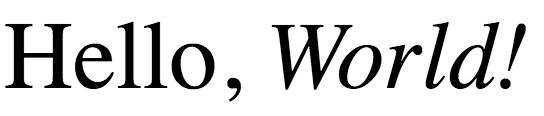

# First Project

### Technologies Used

- HTML

Hey! If you're here, you're probably ready to get started on the first project (if not, why?!?). The first thing we'll need to do is create an account on [CodePen](https://codepen.io). 

### Getting started on CodePen

Once you have created your account at [codepen.io](https://codepen.io), we want to create a new "pen". Each basic project that you create on CodePen is called a "pen", so we will be creating a new pen for each of these lessons. You can do this from the CodePen homepage by clicking the "Pen" button in the top left corner.


Once you've found the button and clicked it, you will be taken to a screen that looks like this.


This is what the CodePen code editor looks like, and this is where we will be doing all of the beginner projects. As you can see, we have three empty windows at the top labeled HTML, CSS, and JS (javascript). These are the three main technologies that make up all websites, and each empty window will each be filled with code in that specific programming language.

When we write code in these top 3 windows, the result will appear in the bottom half of the screen.

### Let's start coding!

For right now, we're only going to be writing code in HTML, so we don't need to see the CSS and Javascript windows. We can hide them by clicking the little arrow icon in the top right corner of the HTML window and clicking on *"Maximize HTML Editor"*. 


Once we've done this, we can start writing code! But in order to do this, we need to know how HTML works.

### What is HTML? 

HTML is an acronym that is short for "HyperText Markup Language". This doesn't really mean much, but it is important to note that HTML is a *markup* language, and not a *programming* language. 

A programming language is probably what you traditionally associate with coding: loops, logic, algorithms, and much more. These are programming languages like Python, Java, and Javascript that you've probably heard of or used. However, a markup language is distinctly different from a programming language.

Unlike a programming language where you write a program with instructions for the computer, markup languages are **presentational**, meaning they just specifiy how the computer should display data. In other words, HTML is merely a way of telling the computer how it should organize and structure data in a webpage. 

### Our first HTML code

To get started with HTML, enter the following line of code in the HTML editor:

```html
<h1>Hello, World!</h1>
```

Give the pen a second or two to update, and you should see the text "Hello, World!" appear in the output box below in a big, bold font. Nice!

Next, add the following line of code on the second line of your HTML editor.

```html
<p>Hello, World! But smaller.</p>
```

If all went well, you should be seeing the output in this image.


Ok, cool! But how did the web browser know how to make the text different sizes for each one? The answer is a fundamental part of HTML: **tags**. In HTML, *tags* are used in the code to tell the web browser how to format and display the content. 


An HTML tag has three main parts: 

- An **opening** tag
- The content to display
- A **closing** tag 

You can recognize the opening and closing tags pretty easily, because they will always be wrapped in pointy brackets **<>**. Inside of the brackets will be a keyword telling the browser what kind of content the tags are for.


#### Example

```html
<h1>Hello, World!</h1>
```

In our first line of code from earlier, we can now recognize our opening and closing tags. Note that the closing tag has a `/` symbol in it to differentiate itself from the beginning tag.

Let's look at the keyword that we put inside of each tag, **h1**. This represents a **header**, or a title. That's why it displayed the text with such a big, bold font! These **header** tags are normally used for displaying the title of a webpage, or any text that needs to stand out from the rest.


#### Example 2:

```html
<p>Hello, World! But smaller.</p>
```

In contrast, let's look at the second line of code we added. The keyword we used in our tags for this text was **p**. The **p** text represents a **paragraph** element, which is really just normal text. That's why it was so much smaller and less exciting than the **h1** text above it. These **paragraph** tags are useful for normal text on a website that doesn't need to stand out.

#### Review

Let's take a brief minute to review: an html element looks like this `<h1>Hello, World!</h1>`, and it will have opening and closing tags, and between them will be the content to display. With this example, the browser would display the text "Hello, World!", and the browser would know to make it **header** text because of the keyword **h1** inside of the opening and closing tags.

### P, H1?? How many HTML keywords are there?

Oh god, so many. There are close to 100 (!!!) HTML tags that you can use, and they all do different things. However, **h1** and **p** tags are some of the most commonly used. Here are some other significant tags:

#### H1-H6

We already know about the **h1** tag, but there are actually many different header sizes! The **h1** tag is the largest, and it goes all the way from **h2, h3.... h6**, with **h6** being the smallest.


#### strong

The `<strong>` tag will take any text inside of it and make it bold. However, unlike the **h1** element, it will not change the size of the text! It just makes whatever content is inside of it bolder.

```html
Hello, <strong>World!</strong>
```

In this example, the text inside of the **strong** tags will be bolder than the text around it.


#### em

The **em** tag is short for "emphasis", and it will convey that you want to emphasize the content inside of the tags. Visually, the emphasized text will be italicized.

```html
Hello, <em>World!</em>
```

In this example, the text inside of the **em** tags will be italicized, while the rest will not be.




### Putting it all together

Ok, we're close to being done with the first lesson! There is just one more thing to demonstrate. While we've shown each of these tags separately so far, it is very possible to combine them together. For example, you could use `<strong>` tags inside of a `<p>` tag, or `<em>` tags inside of an `<h1>` (among endless other combinations).

```html
<h1>Hello, my name is <em>Chris</em></h1>
```

The result of this code will be bolded **header** text, with the word "chris" italicized due to the **em** tag.


### Final Challenge!

Ok, now we have some HTML tags in our toolbox: 

- Header text: **h1**, **h2**, **h3**, **h4**, **h5**, **h6**
- Paragraph text: **p**
- Bolded text: **strong**
- Emphasized/Italic text: **em**

See if you can put them together to form the output in the image below!

{:width="400px"}

